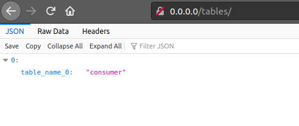
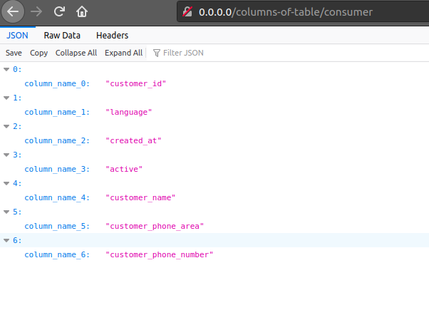
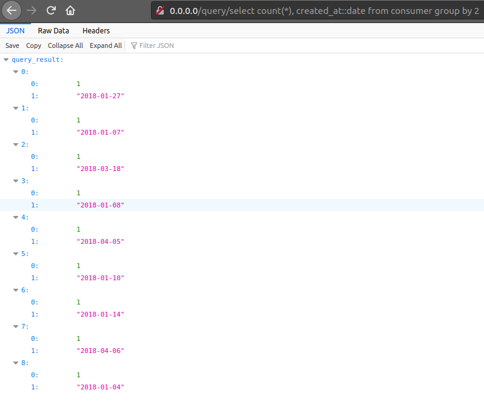
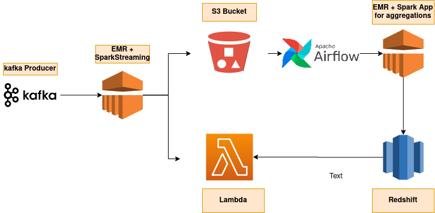

# iFood ML Engineer Test

In this challenge was performed a very straightforward way to fetch, store and get available kafka brokers data. The following
topics will be discussed:

* Implemented Architecture;
* Deployment Instructions;
* API Usage;
* Technical Debits Of Current Implementation;
* Proposed AWS Infrastructure;


---


### Implemented Architecture
Inside the **consumer** folder are all the logic around extract, parse and store the data.

* The [`kafka_consumer`](https://bitbucket.org/JoaoHFerreira/ml-engineer-challenge/src/master/consumer/kafka_consumer.py) are responsible for track topics dynamically and orchestrate the SQL DDL scripts some features are:
    
    a. Discover new topics;
    
    b. Trigger `CREATE TABLE` when a new `topic` is discovered;
    
    c. Trigger `ALTER COLUMN` when a new `key` is discovered;
    
For each topic a new table  will be generated.

* In [`kafka_repository`](https://bitbucket.org/JoaoHFerreira/ml-engineer-challenge/src/master/consumer/kafka_repository.py) the sql scripts are dynamically generated under the control of [`kafka_consumer`](https://bitbucket.org/JoaoHFerreira/ml-engineer-challenge/src/master/consumer/kafka_consumer.py). This module is basically called to : `INSERT, ,CREATE TABLE  and ALTER TABLE` operations. All this SQL scripts are created in dynamic and performatic way.

With all data stored on preview steps, the main mission of Feature-Store-Api is to deliver high quality data, with good documentation.

* Inside **feauture-store-api** the access to the information happens. It was in such a way that it is possible to create your own features. It's ready to explore and consume all tables and columns available


---


### Deployment Instructions
Follow the below instructions to correctly run the FeatureStoreEngine.

* First of a all, you need to have docker installed before start, if you don't,  follow [this link instructions](https://docs.docker.com/engine/install/ubuntu/)

* Now, with docker correctly installed , disable your local postgres  with the command below. In case of not having, just ignore and keep straight to the 3rd step.  This step is necessary because the postgres image is configured to use the default ports.

```shell 
sudo systemctl stop  postgresql
```

* Clone the repo in a path of your choice and enter it:

```shell
git clone https://JoaoHFerreira@bitbucket.org/JoaoHFerreira/ml-engineer-challenge.git;
cd PATH_/OF_/YOUR_CHOICE/ML-Engineer-Challenge/
```

* Inside repo  just run:

```shell
docker-compose up
```

---


### API Usage
For this challenge was thinked a dynamic approach to the api. Basically you are free to choose your 
table, columns and query your own needs with standard SQL. The lines below will demonstrate an use 
case example and step by step walkthrough.

* After run the **Deployment Instructions** , enter in `http://0.0.0.0/tables/` all available
tables for consuming will appear in a json list, like the image below;




* Choose a table and go to the `0.0.0.0/columns-of-table/{TABLE-OF-YOUR-CHOOSE}`, puting the 
chosen in the variable place, a json list of all available columns will appear.



* Create some aggregate query and put in the `query` variable `0.0.0.0/columns-of-table/{TABLE-OF-YOUR-CHOOSE}`. In this 
section you always need to put some aggregate function (`COUNT, SUM, MIN, AVG..`) sequenced by a value that to group.
In the example below the query `select count(*), created_at::date from consumer group by 2` was chosen.




To a more complete documentation take a look on the [API](http://0.0.0.0/docs#) 

---


### Technical Debits Of Current Implementation
There are some technical debts that would prevent this project to scale. I'll try to list all of them and explain the whys.

1. A track to restart from last getted data was not implemented,
 so if the app restarts, it will restart from zero. A good solution for 
 that would be to implement a key storage.

2. There's no raw layer for the data.
This is bad because if you need to consult or aggregate your data
from scratch there will be no start point.

3. Not even all errors are treated. I've put only two data 
treatments, for sure, more than that. is more than
that. Send to a raw layer summing with error log capture would
be a possible solution for that.

4. Despite python be a good start point it's not the best choice to a scalable scenario. 
For more volumes Scala would 
be chosen one

---


### Proposed AWS Infrastructure
The following Infrastructure was thinked considering a kafka cluster producing data 24/7.

1. An EMR cluster will be in charge to send the raw data to S3 and aggregate the chosen features to serve the API;


2. As a second process step we'll have an airflow to trigger another EMR cluster.
    
    a. The mentioned airflow, in fact,  will trigger the EMR steps, and will be responsible to schedule N kind of jobs in EMR;
    
    b. The EMR cluster will struct the data and send to redshift;
   
   
3. Redshift are the storage chosen for some factors like:
   
   
    a. Massively parallel processing: Massively parallel processing (MPP)
   enables fast execution of the most complex queries operating on large 
   amounts of data. ;
   
    b. Columnar data storage: Columnar storage for database tables 
   drastically reduces the overall disk I/O requirements and is an important
   factor in optimizing analytic query performance. ;
   
    c. Query optimizer: The Amazon Redshift query execution engine incorporates
   a query optimizer that is MPP-aware and also takes advantage of the 
   columnar-oriented data storage. ;
   
    d. Result caching: To reduce query execution time and improve system performance, 
   Amazon Redshift caches the results of certain types of queries in memory on the 
   leader node. 
   
   
4. To serve the data a lambda approach was chosen for reasons of 
simplicity (is serverless) and scalability;


See the chart below to get and idea of the proposed infrastructure:



